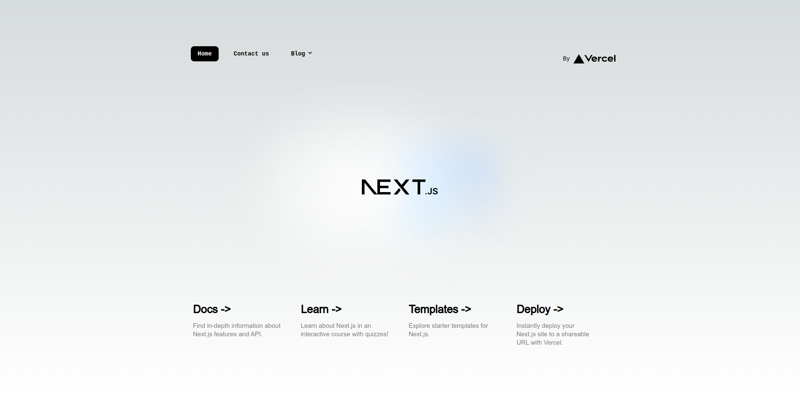

# Next.js + Contentful Template
---

[](LICENCE.md) [](https://www.docker.com/products/docker-desktop) [](https://github.com/Aplyca/next-contentful-template/actions/workflows/deploy.prod.yml) 


This is a [Next.js](https://nextjs.org/) project bootstrapped with [`create-next-app`](https://github.com/vercel/next.js/tree/canary/packages/create-next-app) for develop [[PROJECT_NAME]]([PROJECT_URL]) webpage with [Contentful](https://www.contentful.com) headless CMS and [Vercel](https://www.vercel.com) as PaaS provider.



---

## Development knowledges

[](https://reactjs.org/docs/getting-started.html)
[](https://nextjs.org/docs)
[](https://nextjs.org/learn/excel/typescript)
[](https://www.contentful.com/developers/docs/references/graphql/)
[](https://tailwindcomponents.com/cheatsheet/)
[](https://www.contentful.com/developers/docs/)
[](https://yarnpkg.com/getting-started)
[](https://www.algolia.com/doc/)
[](https://storybook.js.org/docs/react/get-started/introduction)
[-339933?style=for-the-badge&logo=nodedotjs&logoColor=white)](https://nodejs.org/docs/latest/api/)
[-2CA5E0?style=for-the-badge&logo=docker&logoColor=white)](https://docs.docker.com/compose/)
[](https://www.gnu.org/software/make/manual/make.html)
[](https://vercel.com/docs)

Remember mantain the [best good practices](https://stackoverflow.blog/2022/03/30/best-practices-to-increase-the-speed-for-next-js-apps/) and check your code with `make lint`. Logo with "!" mark are required, otherwise are optional.

---

## Development

### Pre-requisites

- [Node JS](https://nodejs.org/docs/latest/api/) 18 or major version is required for this project. If you use Docker it's already configured and ready to work.
- [Yarn](https://yarnpkg.com/getting-started) v4.0.2, this project is configured to preload the yarn version via `.yarnrc.yml`. If you use Docker it's already configured and ready to work.
- [GNU Make](https://www.gnu.org/software/make/manual/make.html) (optional), preinstalled in Linux and macOS, [see for Windows](https://stackoverflow.com/questions/32127524/how-to-install-and-use-make-in-windows) or use [Docker Desktop for WSL 2](https://engineering.docker.com/2019/06/docker-hearts-wsl-2/))
- [Docker](https://www.docker.com) and [Docker compose](https://docs.docker.com/compose/) (optional).

### Make available commands

This project implements [GNU make](https://www.gnu.org/software/make/manual/make.html) to facilitate the tasks concerning Docker commands. You can see a list of the available commands by accessing the help with `make help`:

```
ℹ️   Usage: make <task> [option=value]
Default task: init

{*} Tasks:
  init i          [*] Create and start the environment. This is the default task.
  h help          [!] This help.
  build           [*] Build or rebuild one or all service containers
  up reload       [*] Up/Reload one or all service containers
  start           [*] Start one or all service containers
  restart         [*] Restart one or all service containers
  stop            [*] Stop or or all service containers
  remove          [*] Stop and Remove one or all service containers
  down d          [*] Down one or all service container[s], network[s] and volume[s]
  status ps s     [*] Show status of services
  cli exec        [*] Execute commands in service containers, use "command"  argument to send the command. By Default enter the shell.
  run             [*] Run commands in a new service container
  logs log l      [*] Show logs. Usage: make logs [service=app]
  copy            [*] Copy app files/directories from service container to host
  sync            [*] Copy packages files generated inside service container to host
  linter lint     [*] Lint code
  storybook sb    [*] Reload or UP storybook service
  cfcm.download   [*] Export contentful space content model
  cfcm.backup     [*] Export full contentful space backup
```
### Run project

1. Download project via git `git clone git@github.com:[ORG]/[PROJECT_NAME].git` or https with `git clone https://github.com/[ORG]/[PROJECT_NAME].git`
2. Enter into project dir `cd [PROJECT_NAME]`
3. Configure `.env` (or naming it according to [.env conventions](https://nextjs.org/docs/pages/building-your-application/configuring/environment-variables#environment-variable-load-order) to test multiple environments on your localhost) file with the required [environment variables](#environment-variables). You can use `.env.example` as guide to configure your `.env` file (This file MUST be git-ignored).
4. Install node packages via `yarn install`.
5. Running project:
    - **Using make (it uses docker and docker compose):** run make's command for generate and up containers `make`.
    - **Using docker/docker compose:** run docker compose's command for generate and up containers `docker compose up --remove-orphans --build -d app`.
    - **Using yarn:** run the yarn command to start the project in dev mode with `yarn dev`.
6. Open [http://localhost:27080](http://localhost:27080) with your browser to see the result. Remember, if you have `PROJECT_PORT_PREFIX` var in your `.env` file, the port in URL is {PROJECT_PORT_PREFIX}080. Using yarn the port is always [3000](http://localhost:3000) unless you change it by parameters.
7. Happy coding.

### Test production build locally

Follow 1-4 steps of **[run project's instructions](#run-project)**, then:

**Using make or docker/docker compose:**

5. Enable and change the value of variable `NODE_ENV` in your `.env` file to `production`;
6. Enable and change the value of variable `TARGET_IMAGE` in your `.env` file to `prod`;
7. Run `make` or `docker compose up --remove-orphans --build -d app` as applicable.

**Using yarn:**

5. Enable and change the value of variable `NODE_ENV` in your `.env` file to `production`;
6. Generate production build with the command `yarn build`.
7. Run the project with the command `yarn start`.

### Storybook

This project has implemented [Storybook](https://storybook.js.org/), if you want to start the storybook service follow command below:

**Using make:**

```bash
$ make service=storybook
```

**Using docker/docker compose:**

```bash
$ docker compose up --remove-orphans --build -d storybook
```

**Using yarn:**

```bash
$ yarn storybook
```

Open [http://localhost:27006](http://localhost:27006) with your browser to see the result. Remember, if you have `PROJECT_PORT_PREFIX` var in your `.env` file, the port in URL is {PROJECT_PORT_PREFIX}006. Using yarn the port is always [6006](http://localhost:6006) unless you change it by parameters. 

---

## Workflow

The following instructions are recommended for a smooth and correct workflow:

1. Synchronize the data from the remote repository located in the `main` branch.

```bash
git checkout main
git pull
```

2. Create your working branch using an intuitive name:

```bash
git checkout -b implement-header-block
```

3. Make all the changes you need to resolve the ticket/bug (remember to run ``make lint`` before moving on to the next step to verify that your code complies with the project standards).

4. Add and commit your changes locally (remember to commit your changes with an intuitive message of the changes you made):

```bash
git add . # or git add file-1 folder/file-2 ...
git commit -m "feat: generated and implemented component to render header block"
```

5. Synchronize your branch with the main branch to prevent conflicts, and if there are any resolve them before pushing your changes.

```bash
git pull origin main
```

6. Push the changes to the origin/remote repository so that it creates the branch and syncs your changes.

```bash
git push -u origin implement-header-block
```

7. [Create the pull request](https://docs.github.com/en/pull-requests/collaborating-with-pull-requests/proposing-changes-to-your-work-with-pull-requests/creating-a-pull-request) in your branch repository to the main branch.

8. When you create the pull request, it trigger an action to create a preview envrionment for test purposes. Once it is created, the action will create a comment with the link to the preview like this:


9. Inform via ticket the technical lead or reviewer about your solution (and preview link to review) and update the ticket statuses. If necessary, inform via the project slack channel.

10. When you pull request is merged to main, the previews environments created in your work process will be automatically deleted; then the main branch will start another action to deploy your changes to de production environment and delete the old production environments. 

11. Continue to step 1...

---

## Environment variables

Create .env file with enviroment variables below:

### DEVELOPMENT RUNTIME

- `APP_NAME`: Prefix for docker services names (default: [PROJECT_NAME_MAY]-WEB)
- `TARGET_IMAGE`: Docker image TAG to generate the container, it can be `dev` or `prod` (default: dev)
- `PROJECT_PORT_PREFIX`: Port prefix to map project ports, it's recomended no use prefix port major to 45 or minor to 10 (default: 27).
- `NODE_ENV`: Definnes the mode to run the project, [follow the documentation](https://nodejs.org/en/learn/getting-started/nodejs-the-difference-between-development-and-production) to know more (default: development).
- `DEFAULT_SERVICE`: Can use **storybook** or **app** for avoid service=... argument in make scripts (default: app).

### PROJECT RUNTIME

- `DEFAULT_DOMAIN`: (optional) Default domain for SEO purposes (like metadata, sitemaps, canonical urls, etc.).

#### Contentful settings
- `CONTENTFUL_ENVIRONMENT`: (docker/make: optional, yarn: required) Contentful environment in space (default: master).
- `CONTENTFUL_SPACE_ID`: (required) Contentful space id where data is located.
- `CONTENTFUL_DELIVERY_API_TOKEN`: (required) Contentful token for delivery access API token to retrieve data.
- `CONTENTFUL_PREVIEW_API_TOKEN`: (required) Contentful token for preview access API token to enable live preview, read non published entries, page builder, etc.

#### Cache settings
- `REVALIDATE_SECRET_TOKEN`: (required) NextJS Token for invalidate contents when it changes in Contentful.
- `DRAFT_SECRET_TOKEN`: (required) Token to use with live preview and prevent other apps to use it.

#### Algolia settings
- `ALGOLIA_APP_ID`: (required) Algolia app ID to use in search request.
- `ALGOLIA_SEARCH_API_KEY`: (required) Algolia search API key to access to the search collection.
- `ALGOLIA_INDEX_NAME`: (required) Algolia index name where data is stored.

!!! Please update this file when be needed.
